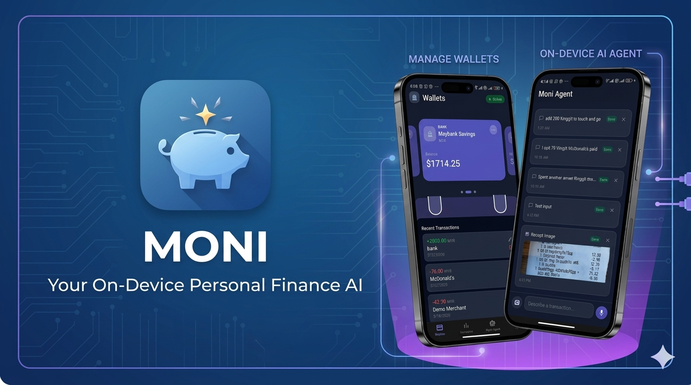
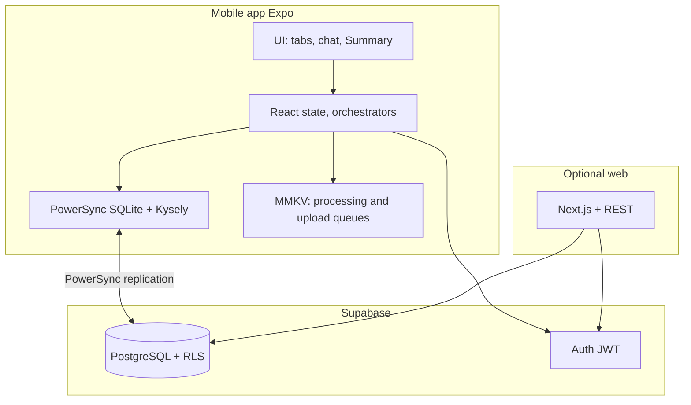
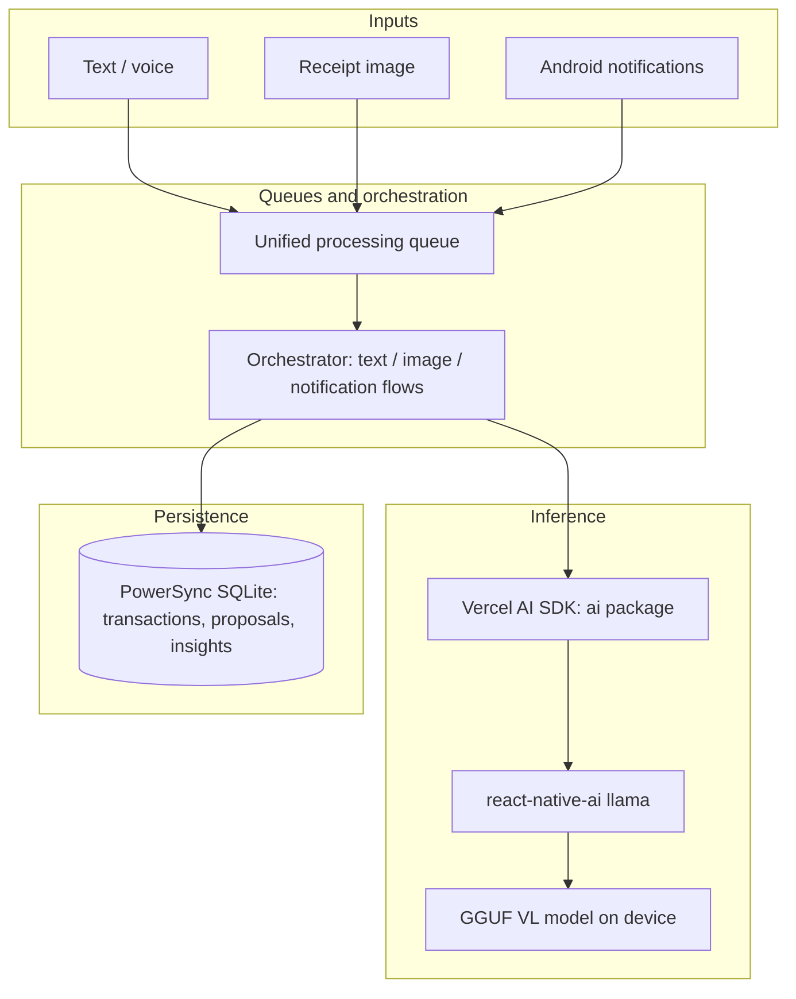
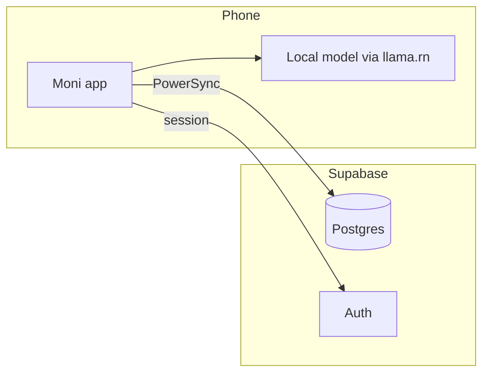

# Moni

<p align="center">
  
</p>

> **Your money. Your model. Your call.**

**Moni** is a **local-first** personal finance app for **iOS and Android** (Expo / React Native). It helps you manage wallets and spending, stay organized offline, sync when you choose—and it runs a **private, on-device vision-language model** so natural language, receipt photos, and (on Android) bank notifications become **reviewable transaction proposals**, not cloud API calls for the core capture flow.

### Hackathon: preview build & demo

**Preview build (EAS):** [Expo build](https://expo.dev/accounts/kaiz827s-organization/projects/moni/builds/a71182c0-d759-47c1-ad4f-a4eb910c6d5e) — **Android only.** This preview does not install or run on iOS as I am too broke for an Apple Dev Account :(

**Demo video:** [YouTube](https://www.youtube.com/watch?v=ftlmI3bbxpI)

**For hackathon judges / anyone demoing the app:** The preview build works **only on Android**. Sign in with the demo account:

- **Email:** `test@example.com`
- **Password:** `Test1234`

---

## Why users should care

| Theme                           | What Moni does                                                                                                                                                                                                                   |
| ------------------------------- | -------------------------------------------------------------------------------------------------------------------------------------------------------------------------------------------------------------------------------- |
| **Privacy by architecture**     | Core AI inference runs **on the phone** (Qwen 3.5 0.8B via `@react-native-ai/llama`). Your prompts and receipt images are not sent to a third-party LLM for extraction.                                                          |
| **Human in the loop**           | The model never posts to your ledger. Everything becomes `**proposed_transactions`\*\* with a review screen—you edit, confirm, or reject before it is real.                                                                      |
| **Trust the math to code**      | Heavy lifting is **deterministic**: SQLite, heuristics, structured JSON. The small model handles **narrow** tasks (extract, classify, match wallets)—same design philosophy as production on-device AI.                          |
| **Offline-first**               | SQLite is the source of truth on device; background sync (PowerSync / Supabase) keeps optional cloud and web in step.                                                                                                            |
| **Finance advisor (direction)** | **Insight cards** and coaching are built as **tools-first**: aggregates and metrics from your data, then short, schema-bound language for nudges—so a hackathon demo can show _your_ numbers turned into prose, still on-device. |

---

## Mobile app: what you get

### Everyday money

- **Multi-wallet** — Bank, cash, cards, digital wallets, and more; balances follow from transactions.
- **Transactions** — Manual entry, categories, filters, and a clear history tied to each wallet.
- **Summary & analytics** — Spending views, charts, and breakdowns built from local (and synced) data—the same data path future **AI insight cards** attach to.
- **Secure sign-in** — Supabase Auth with tokens in secure storage.

### On-device AI agent (capture)

The **unified orchestrator** turns three input types into **pending proposals** only:

| Input                     | Behavior                                                                                                                                |
| ------------------------- | --------------------------------------------------------------------------------------------------------------------------------------- |
| **Text**                  | Describe a purchase or deposit in chat; structured extraction + wallet hints.                                                           |
| **Receipt image**         | Multimodal pipeline: focused vision steps for totals and details, merge, wallet resolution; images stay local-first with queued upload. |
| **Android notifications** | Classify transaction vs. noise (OTP, promos); regex fallback if the model fails.                                                        |

Details: [apps/mobile/lib/ai/ORCHESTRATOR.md](./apps/mobile/lib/ai/ORCHESTRATOR.md).

### Finance advisor (in progress)

Aligned with the **tools + micro–sub-agent** pattern: deterministic metrics (period totals, category velocity, budget vs. cap, anomalies) feed **short, constrained** insight copy—not raw database dumps to the model. Summary-tab **AI insight cards**, **budget coach** nudges, and optional **“ask my money”** flows are designed to demo well on a hackathon stage while staying honest about what runs locally vs. syncs as structured rows.

---

## Web app (companion)

The **Next.js** app in `apps/web` provides a dashboard and **REST API** (`app/api/**/route.ts`) for sync and browser use. Shared **Zod** schemas in `@repo/types` keep mobile and server aligned. Moni’s **hero experience is mobile**; the web stack supports accounts, analytics, and future synced insight history.

---

## Technical architecture

Moni combines **cloud data services** with **on-device** inference: the product story is “sync and auth in the cloud, thinking on the phone.”

| Layer                          | Role                                                                                                                                                                                      |
| ------------------------------ | ----------------------------------------------------------------------------------------------------------------------------------------------------------------------------------------- |
| **Supabase**                   | **PostgreSQL** (canonical rows), **Auth** (JWT), **Row Level Security** for multi-tenant isolation; optional Realtime/Storage as needed.                                                  |
| **PowerSync**                  | **Local SQLite** on mobile (`PowerSyncDatabase` + Kysely) that **replicates** with Postgres via sync rules—offline-friendly reads/writes with eventual cloud consistency.                 |
| `**@react-native-ai/llama`\*\* | Loads a **GGUF** vision-language model on-device; exposes a `**languageModel`\*\* compatible with the AI SDK.                                                                             |
| **Vercel AI SDK** (`ai`)       | `**generateObject`** / `**generateText`** with Zod-backed schemas—structured extraction, wallet resolution, and insight composition **without\*\* calling remote LLM APIs for core flows. |

The diagrams below are **memory-style** views: first, how app layers sit above storage and sync; second, how AI calls are layered on the same device.

### Stack layers (data + sync)



### On-device AI stack



### End-to-end (one screen)



For the full AI pipeline (sub-agents, queues, background processing), see [apps/mobile/lib/ai/ORCHESTRATOR.md](./apps/mobile/lib/ai/ORCHESTRATOR.md).

---

## Monorepo layout

```
apps/mobile/     Expo — SQLite, PowerSync, on-device AI, primary UI
apps/web/        Next.js — App Router + REST API
packages/types/  Shared Zod schemas and TypeScript types
packages/ui/     Shared React components
```

**Mobile stack (high level):** Expo SDK ~54, React Native ~0.81, expo-router, **PowerSync** + SQLite (Kysely), TanStack Query, Tailwind via Uniwind, `**@react-native-ai/llama`** (GGUF VL model), **Vercel AI SDK\*\* (`ai`) for structured generation bound to the local model.

**Web stack (high level):** Next.js 16, Supabase (PostgreSQL + Auth), TanStack Query, Recharts.

---

## Documentation

| Doc                                                                        | Purpose                                                                    |
| -------------------------------------------------------------------------- | -------------------------------------------------------------------------- |
| [PROJECT_CONTEXT.md](./PROJECT_CONTEXT.md)                                 | Deep architecture, API shape, roadmap                                      |
| [apps/mobile/lib/ai/ORCHESTRATOR.md](./apps/mobile/lib/ai/ORCHESTRATOR.md) | On-device pipeline: queue, flows, wallet resolution, background processing |
| [IMPLEMENTATION_SUMMARY.md](./IMPLEMENTATION_SUMMARY.md)                   | Status and quick orientation                                               |
| [docs/SETUP_GUIDE.md](./docs/SETUP_GUIDE.md)                               | Environment and setup                                                      |
| [docs/README.md](./docs/README.md)                                         | Full doc index                                                             |

---

## Quick start

**Prerequisites:** Node.js ≥ 18, pnpm ≥ 9, a [Supabase](https://supabase.com/) project, Expo Go or a dev build.

```bash
git clone https://github.com/yourusername/Moni.git
cd Moni
pnpm install
```

**Environment**

- `apps/web/.env.local` — `NEXT_PUBLIC_SUPABASE_URL`, `NEXT_PUBLIC_SUPABASE_ANON_KEY`, `SUPABASE_SERVICE_ROLE_KEY`
- `apps/mobile/.env` — `EXPO_PUBLIC_SUPABASE_URL`, `EXPO_PUBLIC_SUPABASE_ANON_KEY`, `EXPO_PUBLIC_API_URL` (e.g. `http://localhost:3000/api`)

Apply the schema from [docs/DATABASE_SCHEMA.md](./docs/DATABASE_SCHEMA.md) to your Supabase project.

**Run**

```bash
pnpm dev                  # web + Expo (see root package scripts)
pnpm --filter mobile dev  # mobile only
pnpm --filter web dev     # web only
```

More detail: [docs/SETUP_GUIDE.md](./docs/SETUP_GUIDE.md).

**Common commands:** `pnpm build`, `pnpm lint`, `pnpm check-types`, `pnpm format`.

---

## Security and privacy

- **Local-first** writes on mobile; optional cloud sync.
- **On-device AI** for core capture; proposals reviewed before commit.
- **RLS** on Supabase tables; **HTTPS** for API traffic; tokens in **secure storage** on mobile.

---

## Contributing

1. Fork and branch (`feature/…` or `fix/…`).
2. Run `pnpm lint && pnpm check-types` before opening a PR.
3. Prefer shared types from `@repo/types` and match existing patterns in the app you touch.

---

## Roadmap (high level)

| Phase    | Focus                                                                                                        |
| -------- | ------------------------------------------------------------------------------------------------------------ |
| **Now**  | Wallets, transactions, categories, sync, on-device capture → proposals, mobile + web surfaces                |
| **Next** | Finance advisor insights (tool-backed), budgets, richer analytics, voice where it fits the same orchestrator |

See [PROJECT_CONTEXT.md](./PROJECT_CONTEXT.md) for backlog and phases.

---

## License

MIT — see [LICENSE](LICENSE).

---

## Acknowledgments

[Expo](https://expo.dev/) · [Next.js](https://nextjs.org/) · [Supabase](https://supabase.com/) · [Drizzle](https://orm.drizzle.team/) · [Zod](https://zod.dev/) · [TanStack Query](https://tanstack.com/query) · [Turborepo](https://turbo.build/repo)

---

_Built for people who want to understand their money—without handing the full story to the cloud._

_Last updated: March 23, 2026_
