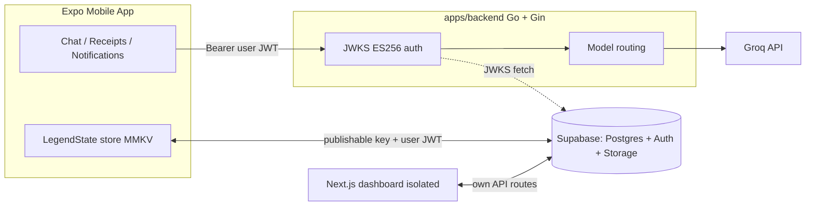

# Moni Architecture

Moni is a local-first personal finance app: an Expo mobile client (primary), a Go AI backend, a Supabase project (database + auth + storage), and an isolated Next.js dashboard.

## System diagram



## Core decisions

- **Mobile is a first-class Supabase client.** Legend-State observables (`apps/mobile/lib/store/index.ts`) sync directly to Postgres via `@legendapp/state/sync-plugins/supabase`, persisted locally in MMKV. Writes hit the local store first; sync happens in the background with soft deletes (`deleted` column) and `last-sync` change tracking.
- **Mobile and web never talk to each other.** The Next.js app (`apps/web`) is a self-contained dashboard with its own API routes for its own pages. Anything both clients need lives in Supabase (data) or the Go backend (AI).
- **The Go backend is stateless.** It verifies the caller's Supabase JWT against the project JWKS (ES256), calls Groq, and returns extraction results. It never touches the database — the mobile client inserts `proposed_transactions` rows itself.
- **AI never writes to the ledger.** Every AI extraction becomes a `proposed_transactions` row that the user approves or rejects in a review modal before a real transaction is created.
- **Shared types via `@repo/types`.** Zod schemas are the single source of truth; TS types are inferred. The Go backend mirrors the wire contract from `apps/mobile/lib/ai/client/types.ts` (kept in sync by convention — see `docs/AI.md`).

## AI data flow

```
Chat text / receipt photo / Android notification
        │
        ▼
MMKV processing queue (lib/ai/processing-queue.ts)
        │
        ▼
background-processor.ts (Android foreground service)
        │
        ▼
run-orchestration.ts → AiClient (lib/ai/client) ──HTTP──► Go backend ──► Groq
        │
        ▼
proposed_transactions (status: pending)
        │
        ▼
ProposalReviewModal → approve → real transaction / reject
```

Android notifications are prefiltered on-device (`lib/notifications/notification-filter.js`: requires a money amount signal AND a transfer signal) before anything reaches the queue, so the backend only sees plausible candidates.

## Auth

- Users authenticate with Supabase Auth (email/password). Sessions persist in MMKV on mobile, cookies on web.
- Supabase signs access tokens with an **asymmetric ES256 key**; the Go backend verifies them statelessly via the JWKS endpoint.
- API keys are the new Supabase key system: `sb_publishable_...` in clients, `sb_secret_...` server-side only. Legacy `anon`/`service_role` JWT keys are being phased out.

## Monorepo layout

```
apps/mobile/      Expo SDK 54 + expo-router — primary client
apps/backend/     Go + Gin AI gateway (see apps/backend/README.md)
apps/web/         Next.js 16 dashboard — isolated, deprioritized
packages/types/   @repo/types — Zod schemas + inferred TS types
packages/ui/      @repo/ui — shared React components (scaffold, unused)
supabase/         Migrations, config.toml, storage policies
docs/             This documentation set
```

Turborepo orchestrates everything, including Go: `apps/backend/package.json` shells out to `go run` / `go build` / `go vet` / `go test`, so `pnpm dev` and `turbo run lint` treat the backend like any other workspace.

## Scale assumptions

Designed for a solo developer targeting ~1000 users at minimal cost:

- Supabase free tier (Postgres, auth, storage, realtime)
- Groq Developer tier (pay-per-token; low single-digit $/month at this scale — see `docs/AI.md`)
- Go backend on Cloud Run with scale-to-zero (free tier covers this traffic)
